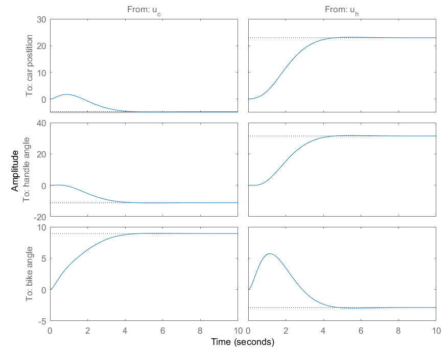
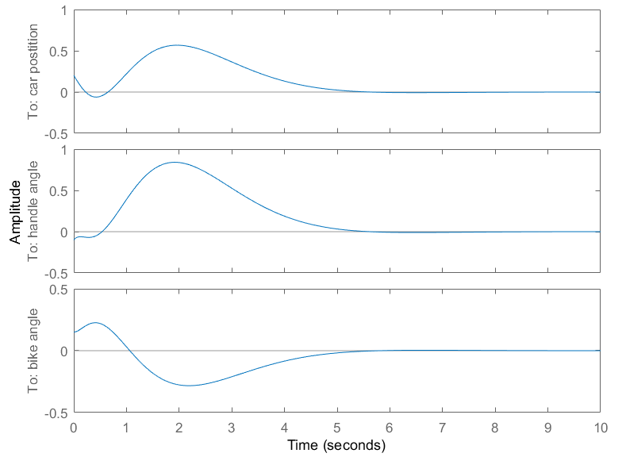
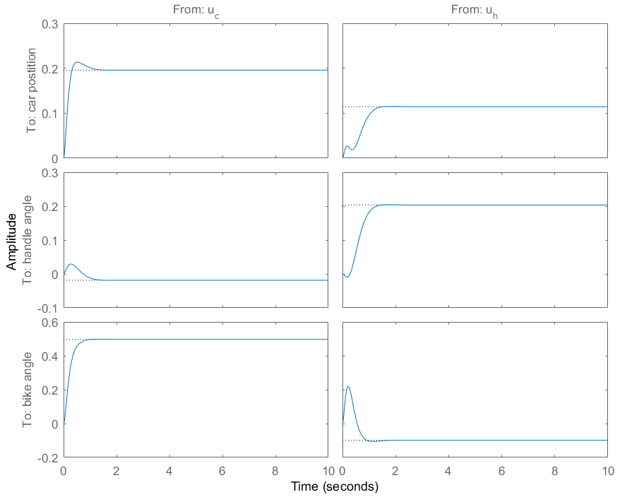
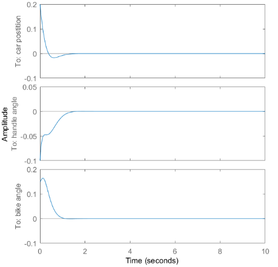
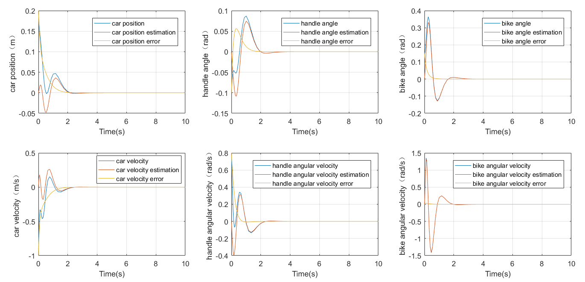
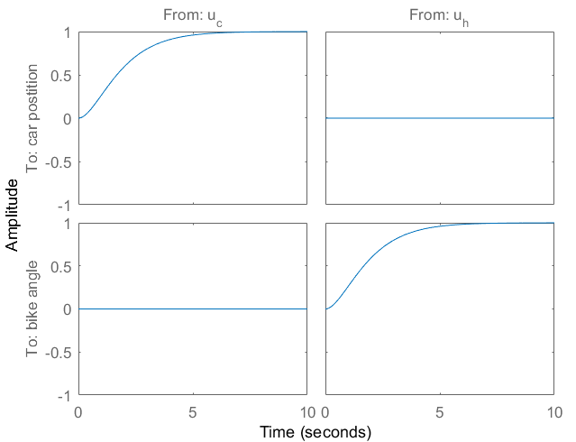
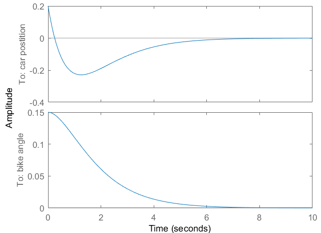
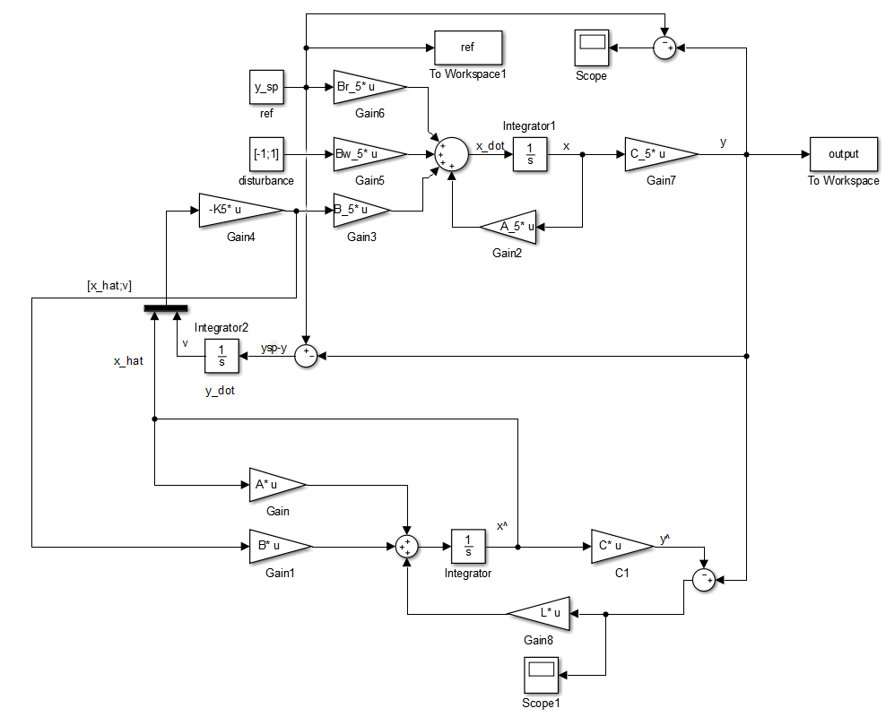
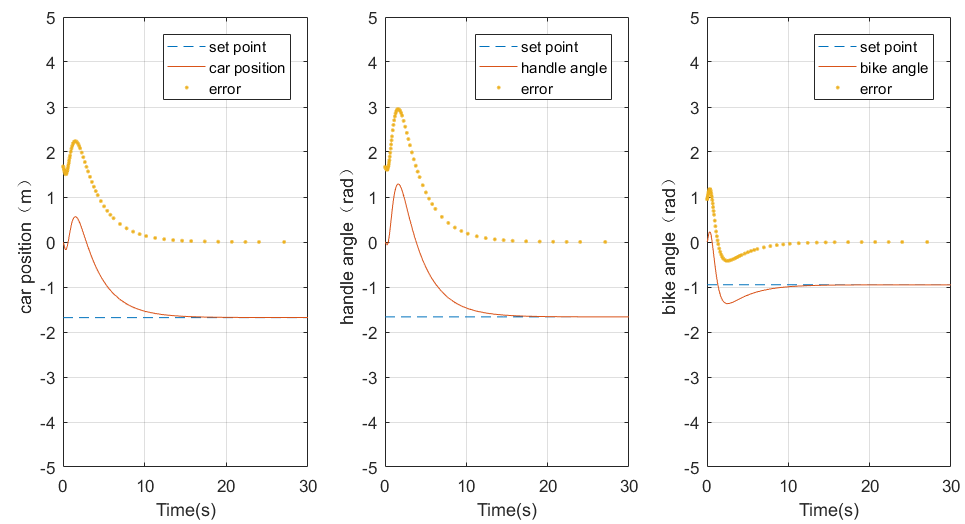

# Self-balancing-Two-wheeled-vehicle
Design the control system of a stationary self balancing two-wheeled vehicle

## Brief Introduction
We have the state space linear model for the two-wheeled vehicle:  
$\dot{x} = Ax + Bu$  
$y = Cx$  
The state variable is  
$x = ([car position, handle angle, bike angle, \dot{car position}, \dot{handle angle}, \dot{bike angle}])^T$

## Feedback Design (measure 6 state variavles)
Use the pole placement method and LQR to perform feedback control and observe transient respose and non-zero initial state with zero external inputs. 
Pole Placement:  

  
LQR:  

## Design State Observer (measure 3 variables)
Design a state observer, simulate the resultant observer-based LQR control system, monitor the state estimation error, investigate effects of observer poles on state estimation error and closed-loop control performance.  
  

## Design the decoupling system
Interested in the outputs of car position and bike angle. Design a decoupling controller with closed-loop stability of the 2-input-2-output system.

## Servo control 
Assume the step disturbance for the two inputs, $𝑤 = ([−1, 1])^T$ takes effect from time $𝑡_𝑑 = 10𝑠$ afterwards.  
Build an observer to get the estimation of the six states of the system to feedback to the original system because of the noise of three sensors.  
The simulink module in MATLAB:  
  
The response of the observer-based servo controller  

## Set-point tracking analysis
Set different track points and analyze the response. 

## Finally
All the details of this project are shown in the pdf file including the theories and calculations.
The simulink model are uploaded in the simulink file.

If you think it is useful for you work, please give me a star.
If you find some problems in this project, you can leave the comment. Thank you !!
